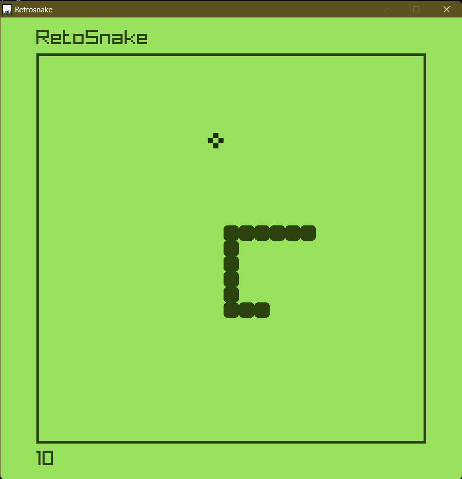

# RetroSnake

## Description
This is a classic snake game implemented in C++. The game is inspired by the legendary Snake game found on Nokia mobile phones. The objective of the game is to control a snake using arrow keys to eat food pellets, which make the snake grow longer. The game ends when the snake collides with the boundaries of the game screen or itself.

## Features
- Classic gameplay reminiscent of Nokia's Snake game.
- Smooth snake movement.
- Score tracking to keep track of the player's performance.

## Controls
- Use arrow keys (Up, Down, Left, Right) to control the direction of the snake.

## Requirements
- C++ compiler supporting C++11 or later.
-raylib installed in computer. you can find it repo [here](https://github.com/raysan5/raylib).
- Terminal or console environment to run the game.

## How to Run
1. Clone this repository to your local machine.
2. Navigate to the directory containing the source code files.
3. open the main.cpp file and run as debug or press `f5` to run.

## Screenshots
